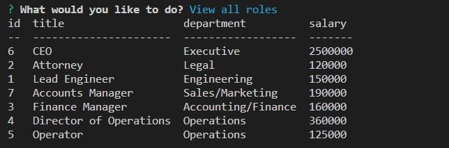
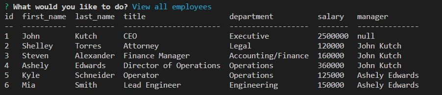

# employee-tracker-jk12
# Employee Tracker
# 
 
 

## Description
In this project, an application called "Employee Tracker" that can be used to enter, edit, save and delete employee infromation in a company database.  It will present tables for employee's, job roles and company departments.

## Table of Contents

  * [User Story](#userstory)
  * [Acceptance Criteria](#acceptance)
  * [Installation](#installation)
  * [Usage](#usage)
  * [Tests](#tests)
  * [Links](#links)
  * [Mockup](#mockup)
  * [License](#license)

## User Story
  
AS A business owner 
I WANT to be able to view and manage the departments, roles, and employees in my company 
SO THAT I can organize and plan my business 

## Acceptance Criteria
  
GIVEN a command-line application that accepts user input 
WHEN I start the application 
THEN I am presented with the following options: view all departments, view all roles, view all employees, add a department, add a role, add an employee, and update an employee role 
WHEN I choose to view all departments 
THEN I am presented with a formatted table showing department names and department ids 
WHEN I choose to view all roles 
THEN I am presented with the job title, role id, the department that role belongs to, and the salary for that role 
WHEN I choose to view all employees 
THEN I am presented with a formatted table showing employee data, including employee ids, first names, last names, job titles, departments, salaries, and managers that the employees report to 
WHEN I choose to add a department 
THEN I am prompted to enter the name of the department and that department is added to the database 
WHEN I choose to add a role 
THEN I am prompted to enter the name, salary, and department for the role and that role is added to the database 
WHEN I choose to add an employee 
THEN I am prompted to enter the employee’s first name, last name, role, and manager, and that employee is added to the database 
WHEN I choose to update an employee role 
THEN I am prompted to select an employee to update and their new role and this information is updated in the database  

## Installation 
  
    1) User can copy repository from github at: (https://github.com/jckutch/employee-tracker-jk12) 
    2) Then install all dependencies with `npm i` in terminal. 
    3) Then in `server.js` replace line 11 password (*) with your (personal MySQL password). 
    4) Then log into MySQL by entering `mysql -u root -p` in the command line, using your personal password. 
    5) Then execute database by entering `SOURCE db/schema.sql` followed by ` SOURCE db/seeds.sql`. 
    5) Then enter `quit` in MySQL and enter `npm start` in terminal to run application. 

## Usage
  
User can view, add, delete and update employee information from the database. 

## Tests
  
No test

## Links
  
Repository Link:  https://github.com/jckutch/employee-tracker-jk12 

## Mockup
  
  Link to Mockup VIDEO: 
   https://drive.google.com/file/d/1U1bRbCtEWhxDGv5d3r3lJBGbJiwbXJlZ/view 
    

Sample Images: 

 
 
 

## License 
   License
Licensed under   .
